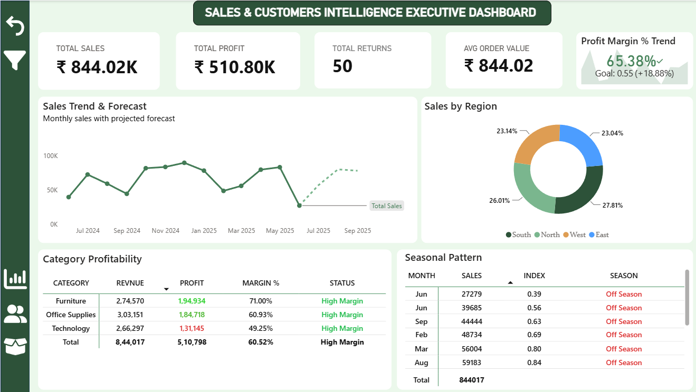
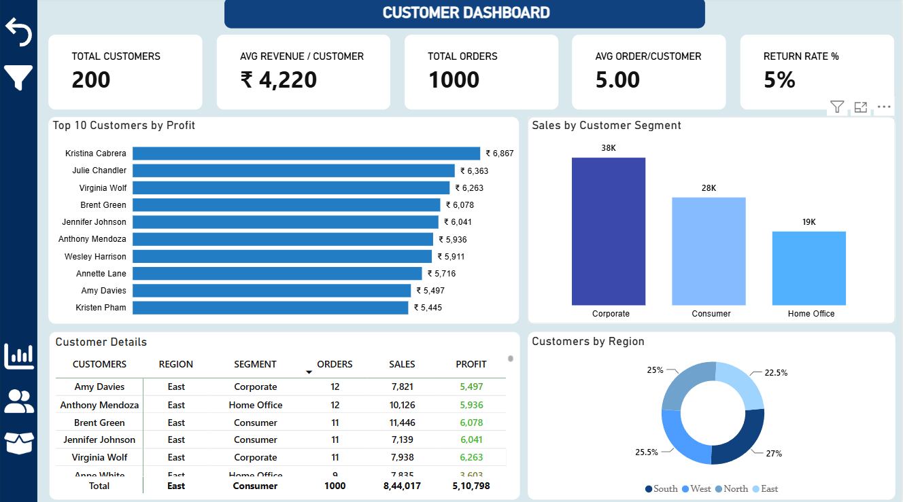
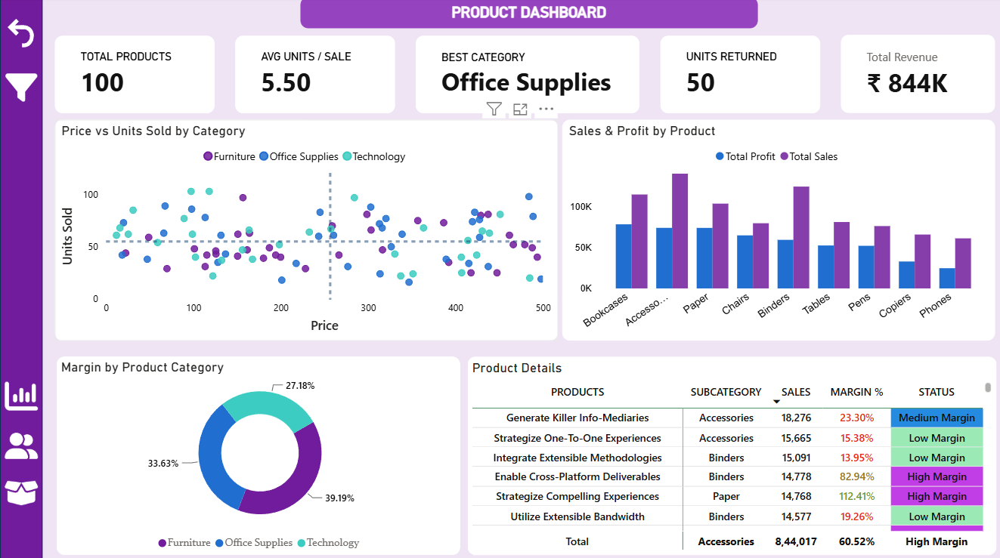

# 📊 Sales & Customer Intelligence Dashboard — Power BI Project

An interactive Power BI dashboard covering Sales, Customer, and Product performance — built on a Star Schema data model with a dedicated Measures table, three linked report pages, and button-driven navigation.

---

## 🖼️ Dashboard Preview

### Executive Dashboard


### Customers Dashboard


### Products Dashboard


---

## 📌 Project Overview

| Property | Details |
|---|---|
| Tool | Microsoft Power BI Desktop |
| File | Sales & Customer Intelligence Dashboard.pbix |
| Total Pages | 3 (Executive, Customers, Products) |
| Total Visuals | 65 charts/tables/cards + 8 slicers + shapes, images, buttons |
| Schema Type | Star Schema |
| Navigation | Bookmark-driven action buttons (page-to-page nav + show/hide filter panel + clear filters) |

---

## 🗃️ Data Model — Tables

| Table | Type | Role in Model |
|---|---|---|
| Sales_Fact *(inferred)* | Fact Table | Central transactional table — underlies all Sales/Profit/Orders/Returns measures |
| Customer_Dim | Dimension Table | Customer master — Name, Segment |
| Product_Dim | Dimension Table | Product master — Name, Category, Sub-Category, Price |
| Region_Dim | Dimension Table | Region master — Region Name |
| Date_Dim | Dimension Table | Calendar table — Year, Year-Month |
| Measures (2) | Measures Table | All DAX calculated measures (no data rows) |

> **Schema:** A single Sales fact table sits at the centre, surrounded by Customer, Product, Region, and Date dimension tables — a classic Star Schema, with all calculations centralised in a separate Measures table.

---

## 📋 Dimension Columns Used in the Report

### 👤 Customer_Dim
| Column | Used In |
|---|---|
| FullName | Top Customers chart, Customer Details table |
| Segment | Segment chart, Segment slicer |

### 📦 Product_Dim
| Column | Used In |
|---|---|
| Category | Profitability table, Margin donut, Scatter chart, Category slicer |
| SubCategory | Sales & Profit chart, Product Details table, Sub-Category slicer |
| ProductName | Product Details table, Scatter chart |
| Price | Scatter chart |

### 🌍 Region_Dim
| Column | Used In |
|---|---|
| RegionName | Sales by Region donut, Customers by Region donut, Region slicer |

### 📅 Date_Dim
| Column | Used In |
|---|---|
| Year-Month | Sales Trend, Seasonal Pattern, Profit Margin % Trend, Year-Month slicer |
| Year | Year slicer |

---

## 📐 DAX Measures (Measures (2) Table)

| Measure | Purpose |
|---|---|
| Total Sales | Sum of sales value |
| Total Profit | Sum of profit value |
| Total Revenue | Sum of revenue |
| Total Returns | Count/sum of returned transactions |
| Total Orders | Count of orders |
| Total Customer | Distinct count of customers |
| Total Products | Distinct count of products |
| Units Returned | Sum of returned units |
| Total Units Sold | Sum of units sold |
| Avg Order Value | Total Sales ÷ Total Orders |
| Avg Revenue Per Customer | Total Revenue ÷ Total Customer |
| Avg Orders Per Customer | Total Orders ÷ Total Customer |
| Avg Units Per Sale | Total Units Sold ÷ Total Orders |
| Return Rate % | Returns as a percentage of total orders |
| Profit Margin % | Total Profit ÷ Total Revenue |
| Profit Margin Classification | Categorical label (e.g., High / Medium / Low margin) |
| Margin Target | Target benchmark line for Profit Margin % trend |
| Seasonal Index | Index measuring seasonal sales variation |
| Season Classification | Categorical label for seasonal pattern |
| Best Category (by Sales) | Top-performing product category by sales |

---

## 📊 Report Pages & Visuals

### Page 1 — Executive Dashboard

| Visual | Type | Fields Used |
|---|---|---|
| KPI Cards (×4) | Card | Total Sales · Total Profit · Avg Order Value · Total Returns |
| Sales by Region | Donut Chart | RegionName (legend), Total Sales (value) |
| Sales Trend & Forecast | Line Chart | Year-Month (axis), Total Sales (value) |
| Category Profitability | Pivot Table | Category, Total Revenue, Total Profit, Profit Margin %, Profit Margin Classification |
| Seasonal Pattern | Pivot Table | Year-Month, Total Sales, Seasonal Index, Season Classification |
| Profit Margin % Trend | KPI Visual | Year-Month (axis), Profit Margin % (value), Margin Target (goal) |
| Slicers (×4) | Slicer | Year-Month · Year · Category · RegionName |
| Action Buttons (×2) | Nav / Clear filters | Bookmark-triggered |
| Text Box, Shapes, Images | Layout elements | Titles, icons, background |

### Page 2 — Customers Dashboard

| Visual | Type | Fields Used |
|---|---|---|
| KPI Cards (×5) | Card | Total Customer · Avg Revenue Per Customer · Total Orders · Return Rate % · Avg Orders Per Customer |
| Top 10 Customers by Profit | Clustered Bar Chart | FullName (axis), Total Profit (value) |
| Sales by Customer Segment | Clustered Column Chart | Segment (axis), Total Sales (value) |
| Customer Details | Pivot Table | FullName, RegionName, Segment, Total Orders, Total Profit, Total Sales |
| Customers by Region | Donut Chart | RegionName (legend), Total Customer (value) |
| Slicers (×2) | Slicer | Segment · RegionName |
| Action Buttons (×2) | Nav / Clear filters | Bookmark-triggered |
| Text Box, Shapes, Images | Layout elements | Titles, icons, background |

### Page 3 — Products Dashboard

| Visual | Type | Fields Used |
|---|---|---|
| KPI Cards (×5) | Card | Total Products · Units Returned · Avg Units Per Sale · Best Category (by Sales) · Total Revenue |
| Price vs Units Sold by Category | Scatter Chart | Category (legend), Price (X), Total Units Sold (Y), ProductName (details) |
| Sales & Profit by Product | Clustered Column Chart | SubCategory (axis), Total Sales & Total Profit (values) |
| Margin by Product Category | Donut Chart | Category (legend), Profit Margin % (value) |
| Product Details | Pivot Table | ProductName, SubCategory, Total Sales, Profit Margin %, Profit Margin Classification |
| Slicers (×2) | Slicer | Category · SubCategory |
| Action Buttons (×2) | Nav / Clear filters | Bookmark-triggered |
| Text Box, Shapes, Images | Layout elements | Titles, icons, background |

> **Navigation:** All three pages are linked through action buttons wired to bookmarks (`clear customers filters`, `clear products filters`, `Clear filters Executive dashboard`) and filter-panel toggles (`Hide/Show Filter`, per page) — giving a tab-style click-through experience instead of a single scroll.

---

## 🔗 Relationships & Cardinality (assumed, based on Star Schema pattern)

| From Table (Dimension) | To Table (Fact) | Cardinality | Status |
|---|---|---|---|
| Customer_Dim | Sales_Fact | 1 : * | ✅ Active |
| Product_Dim | Sales_Fact | 1 : * | ✅ Active |
| Region_Dim | Sales_Fact | 1 : * | ✅ Active |
| Date_Dim | Sales_Fact | 1 : * | ✅ Active |

---

## 🛠️ Tech Stack

- **Tool:** Microsoft Power BI Desktop
- **Features Used:** Report View, DAX Measures, Star Schema, Bookmarks, Action Buttons, Slicers, KPI Visual, Scatter/Pivot/Donut/Column/Bar visuals
- **Operations:** Data Modelling, DAX Calculations (margins, averages, rates, classifications), Bookmark-based Navigation, Multi-page Interactive Filtering

---

## 📁 Project Structure

```
sales-customer-intelligence-dashboard/
│
├── Sales & Customer Intelligence Dashboard.pbix   # Main Power BI file
├── screenshots/
│   ├── executive-dashboard.png                    # Executive Dashboard preview
│   ├── customers-dashboard.png                    # Customers Dashboard preview
│   └── products-dashboard.png                     # Products Dashboard preview
└── README.md                                      # Project documentation
```
